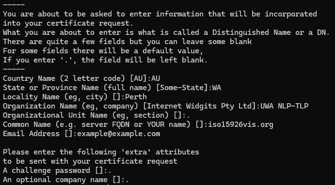

## Requesting SSL certificates

On any linux system, preferably the AWS instance in use, perform the command:

```sh
sudo openssl req -new -newkey rsa:2048 -nodes -keyout private.key -out csr.pem
```

Ensuring to fill out the relavent fields, and example includes:


(Note: do not request for wildcard certificate unless supported)

After filling in the details, a `private.key` and a `csr.pem` file is generated in the working directory. The contents in `csr.pem` is the CSR (Certificate Signing Request), and is to be used in requesting a new certificate or renewing an old one.

## Validating Domain Ownership

The easiest method to confirm domain ownership is to choose the DNS option. This will give you a sub-domain that needs to be linked to an external site through a CNAME record. In the current setup the deployment uses Cloudflare, so the record must be added to Cloudflare ensuring the **proxy is turned off**. After 30 minutes a certificate should be emailed to the registered email account on the CSR.

## Uploading to deployment

The **entire contents (including the begging and ending flags)** from `private.key` should be copied to the GitHub Action Secret named `SSL_PRIVATE_KEY`. The contents of the certificate file `iso15926vis_org.crt` (or ending in .crt) should be copied to `SSL_CERTIFICATE` and the contents of `iso15926vis_org.ca-bundle` (or ending in .ca-bundle) should be copied to `SSL_CA_BUNDLE`.

**Please ensure these files are not disclosed anywhere as they are private.**
